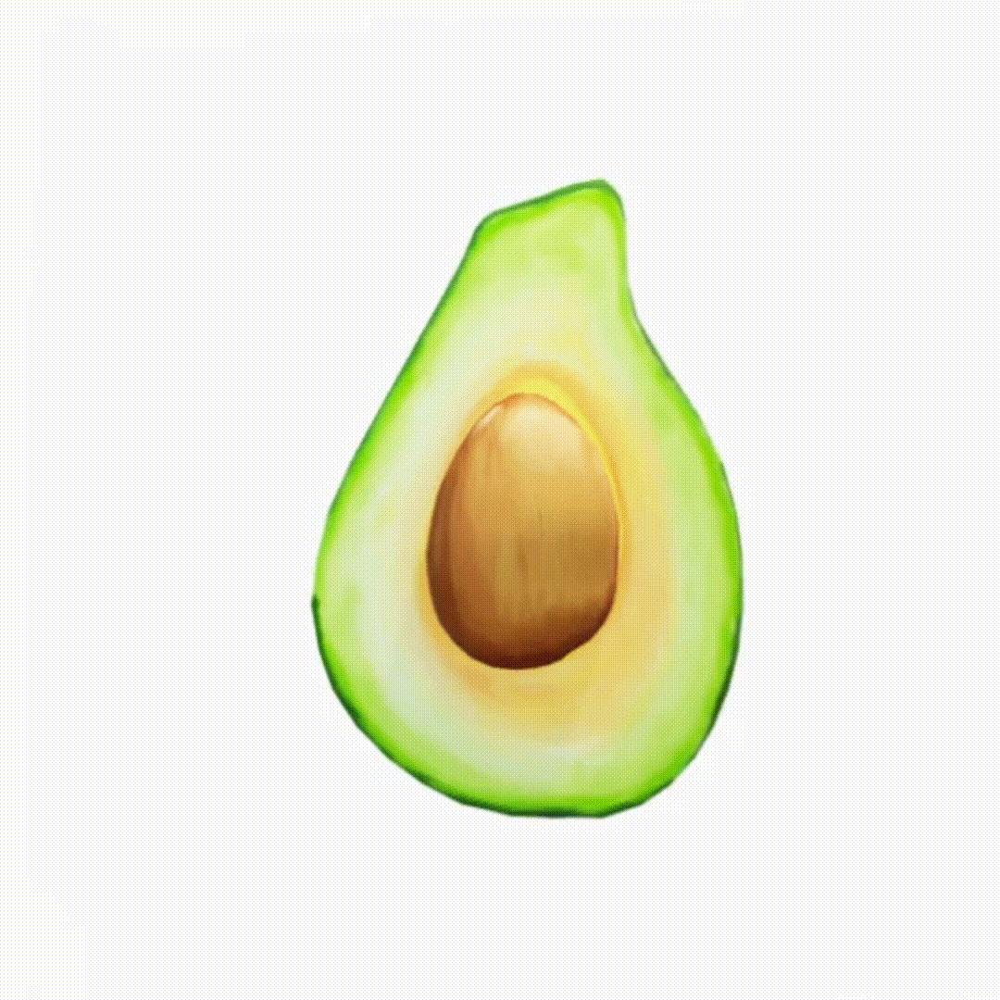
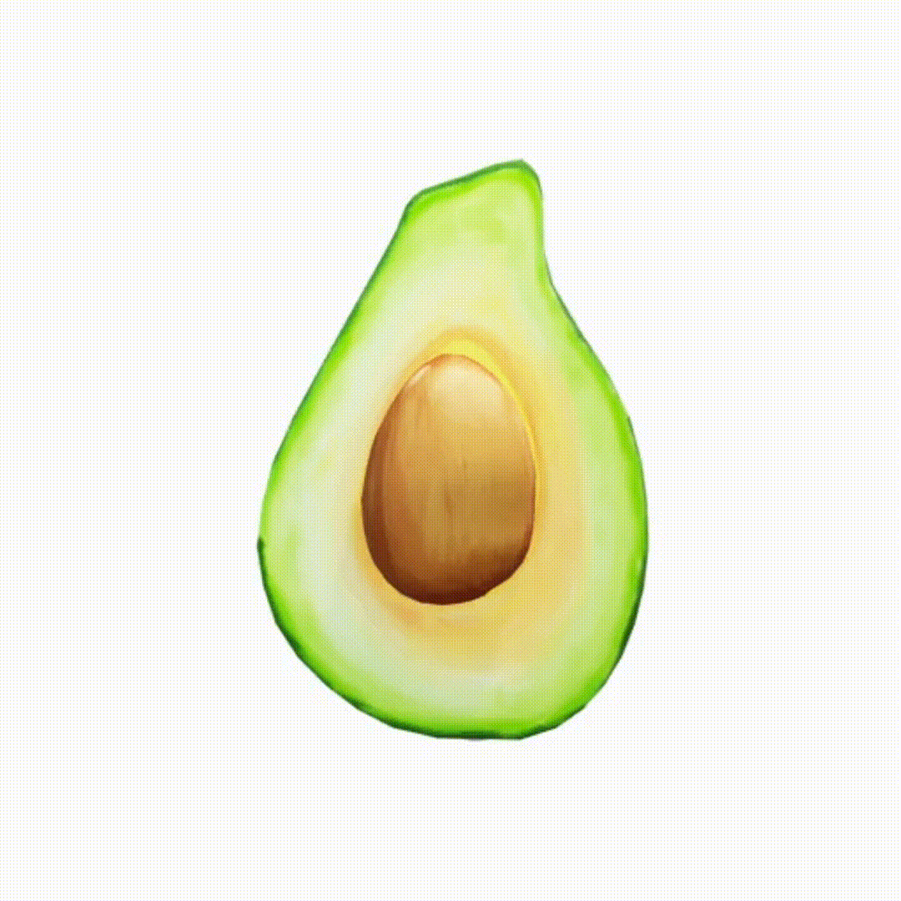

# LVMM

Animating General Image with Large Visual Motion Model

  
  
  
  

We plan to make the code related to our experiment openly available in the near future. However, the training procedure for the LVMM model incorporates some of our company's internal data. We're currently in discussions with our legal team to address potential conflicts of interest. It's possible that we may only release some pre-trained models that were developed using public datasets.

- **Video Viewing Recommendation:**
  If the videos on the webpage cannot be rendered properly, we recommend downloading them for local viewing. This will ensure that you can fully appreciate the dynamic effects demonstrated in the videos.

## Motion transfer across scenes

  

    <strong>Golden leaf (source motion)</strong>
    
  

  

    <strong>Transfer to Brown leaf by replacing $\{z_0, z_1, \cdots\}$</strong>
    
  

  

    <strong>Transfer to Avocado by replacing $\{z_0, z_1, \cdots\}$</strong>
    
  

  

    <strong>Transfer to Avocado by replacing $\{u_0, u_1, \cdots\}$</strong>
    
  

## A Brief Introduction to Installation and Training

Our code primarily references the implementation from the [LFDM](https://github.com/nihaomiao/CVPR23_LFDM) project. Install the environment using `conda env create -f environment.yml`.

- `python run_fdm.py configs/train_fdm.yaml --batch_size 12` to train FrameDiffusion.

- `python run_lfae.py configs/train_lfae.yaml --batch_size 6` to train ReconstructionModel.

- `python run_lfdm.py configs/train_lfdm.yaml --batch_size 32` to train FlowDiffusion.

Before starting the training, you need to update the data paths in the configuration files. You can refer to `data/webvid10m.py` to process your dataset.
During the training of FLAE, images are normalized between 0 and 1, not [-1, 1]. If using CLIP/ImageBind as a feature extractor, it is necessary to align data preprocessing.

We have currently only open-sourced the core code for training and inference. If you encounter any issues during the training process, please feel free to raise an issue. Additionally, models trained directly on the original webvid dataset generally do not achieve good results. We have spent a significant amount of effort in cleaning both public and private datasets during our experiments. Therefore, if you want to achieve good results, you need to ensure that your training data is of high quality. High-quality training data is far more important than the quantity of data.